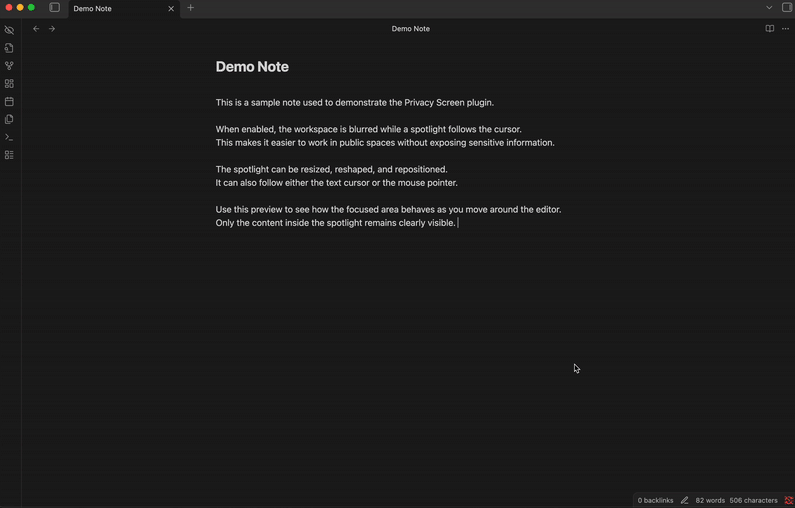

# Privacy Screen

An Obsidian plugin that blurs your workspace while keeping a spotlight around your cursor, providing privacy when working in public spaces.

## Features

- **Blur overlay** - Blurs the entire Obsidian workspace except for a configurable spotlight area around the cursor
- **Spotlight shapes** - Choose between circle or square (with adjustable corner roundness)
- **Independent size control** - Adjust spotlight width and height separately
- **Horizontal offset** - Shift the spotlight left or right relative to the cursor position
- **Tracking modes** - Follow the text cursor or mouse pointer
- **State persistence** - Remembers whether privacy screen was active when you close Obsidian

## Installation

### From Obsidian Community Plugins
1. Open Obsidian Settings
2. Go to Community Plugins and disable Safe Mode
3. Click Browse and search for "Privacy Screen"
4. Install and enable the plugin

### Manual Installation
1. Download `main.js`, `manifest.json`, and `styles.css` from the latest release
2. Create a folder `privacy-screen` in your vault's `.obsidian/plugins/` directory
3. Copy the downloaded files into that folder
4. Reload Obsidian and enable the plugin in Settings > Community Plugins

## Usage

- Click the **eye-off icon** in the ribbon to toggle the privacy screen
- Use the command palette (`Ctrl/Cmd + P`) and search for "Toggle privacy screen"

## Settings

| Setting | Description |
|---------|-------------|
| Spotlight width | Width of the clear area in pixels |
| Spotlight height | Height of the clear area in pixels |
| Horizontal offset | Shift spotlight left (-) or right (+) relative to cursor |
| Blur intensity | How blurry the surrounding area should be |
| Feather edge | Softness of the spotlight edge |
| Spotlight shape | Circle or Square |
| Corner roundness | Roundness of square corners (only for square shape) |
| Tracking mode | Follow text cursor or mouse pointer |

## Commands

All commands can be bound to hotkeys in Settings > Hotkeys:

- Toggle privacy screen
- Increase/Decrease spotlight width
- Increase/Decrease spotlight height
- Increase/Decrease blur intensity
- Increase/Decrease horizontal offset
- Toggle tracking mode (cursor/mouse)
- Reset to default settings

## Acknowledgements 

- Inspired by [Pwritevacy](https://github.com/Kuneosu/P-write-vacy)

## License

[MIT](LICENSE)
